<picture>
  <!--  -->
  <source media="(prefers-color-scheme: dark)" srcset="dark.svg">
  <source media="(prefers-color-scheme: light)" srcset="light.svg">
  >
</picture>

<h1 align="center">Deepanshu</h1>

  

  
  &nbsp;
  
  &nbsp;
  
  &nbsp;
  
  &nbsp;
  

---

## About Me

I am **Deepanshu**, a **B.Tech Computer Science student at Lovely Professional University** from **Haryana, India**. My current work is centered on building strong computer science fundamentals while exploring practical applications of **Artificial Intelligence**, **Machine Learning**, and **software engineering**.

I focus on writing clean programs in **Python** and **C++**, improving my **DSA** and **competitive programming** skills, and learning how production software is structured through **OOP**, **DBMS**, **full stack development**, **system design**, and open source practices. I am especially interested in building useful AI applications that connect solid engineering with real-world problem solving.

## Current Focus

- Strengthening DSA through consistent C++ and Python practice.
- Learning machine learning fundamentals and applying them in small AI projects.
- Building a deeper foundation in DBMS, OOP, software engineering, and system design.
- Exploring full stack development so AI applications can be shipped as usable products.
- Contributing to open source with readable code, useful documentation, and respectful collaboration.

## GitHub Stats

## Featured Projects

| Project | Focus | Status |
| --- | --- | --- |
| AI Application Sandbox | Python, machine learning experiments, prompt engineering, applied AI workflows | Building |
| DSA Practice Tracker | C++, Python, problem solving notes, pattern-based revision | Building |
| Full Stack Learning Lab | Frontend fundamentals, APIs, databases, clean project structure | Learning |

## Learning Roadmap

| Stage | Topics | Outcome |
| --- | --- | --- |
| Foundation | C, C++, Python, Git, GitHub | Write reliable programs and manage code professionally |
| CS Core | DSA, OOP, DBMS, OS, CN | Build strong problem-solving and system-level understanding |
| AI/ML | Python ML stack, model evaluation, applied AI | Create useful AI experiments and small applications |
| Full Stack | UI, APIs, databases, deployment basics | Turn ideas into usable software products |
| Engineering Depth | System design, testing, documentation, open source | Build maintainable projects and collaborate effectively |

## Contact

- Email: [Deepanshubhardwaj8708@gmail.com](mailto:Deepanshubhardwaj8708@gmail.com)
- GitHub: [DEEPANSHU-CODER2007](https://github.com/DEEPANSHU-CODER2007)
- LinkedIn: [deepanshu-bhardwaj-309273385](https://www.linkedin.com/in/deepanshu-bhardwaj-309273385)
- Location: Haryana, India

