<picture>
  <source media="(prefers-color-scheme: dark)" srcset="dark.svg">
  <source media="(prefers-color-scheme: light)" srcset="light.svg">
  
</picture>

<h1 align="center">Deepanshu</h1>

  

  
  &nbsp;
  
  &nbsp;
  
  &nbsp;
  
  &nbsp;
  

---

## About Me

I am **Deepanshu**, a **B.Tech Computer Science student at Lovely Professional University** from **Haryana, India**. I am developing as a **C++ and Python engineer** with a focus on algorithms, systems thinking, and practical AI application development.

I use **competitive programming** to sharpen complexity analysis, correctness under constraints, edge-case reasoning, and implementation speed. Alongside this, I am building toward production-minded AI systems through APIs, databases, evaluation workflows, testing, and deployment fundamentals.

## Tech Stack

  
  
  
  
  
  
  
  
  
  
  
  
  
  

## Engineering Focus

- Building stronger C++ foundations in algorithms, data structures, memory behavior, and performance analysis.
- Treating competitive programming as deliberate practice for correctness, complexity trade-offs, and technical execution.
- Developing AI applications with reproducible experiments, retrieval/evaluation workflows, and clear failure analysis.
- Learning API design, SQL databases, testing, Docker, and deployment fundamentals for end-to-end software delivery.
- Studying operating systems, networking, concurrency, and Linux fundamentals for performance-sensitive systems.

## GitHub Stats

## Contribution Snake

## Featured Projects

| Project | Engineering Scope | Status |
| --- | --- | --- |
| AI Evaluation and Retrieval Platform | Python AI application with retrieval, evaluation datasets, response-quality analysis, API design, and observability goals | In progress |
| Algorithm and Performance Notebook | C++ and Python implementations with complexity notes, tests, benchmarks, and competitive-programming patterns | In progress |
| Full Stack Delivery Platform | End-to-end application work spanning frontend, APIs, authentication, databases, testing, and containerized delivery | In progress |

## Education

**Lovely Professional University**  
B.Tech Computer Science Student

Core academic focus: programming fundamentals, DBMS, OOP, DSA, software engineering, operating systems, computer networks, AI, and machine learning.

## Learning Roadmap

| Stage | Topics | Outcome |
| --- | --- | --- |
| Foundation | C, C++, Python, Git, GitHub | Write reliable programs and manage code professionally |
| CS Core | DSA, OOP, DBMS, OS, CN | Build strong problem-solving and systems understanding |
| Performance | Linux, concurrency, profiling, networking, benchmarking | Develop performance-aware C++ engineering skills |
| AI/ML | Python ML stack, model evaluation, retrieval, applied AI | Build measurable and reliable AI applications |
| Delivery | APIs, databases, testing, Docker, deployment basics | Turn ideas into maintainable software products |

## Contact

- Email: [Deepanshubhardwaj8708@gmail.com](mailto:Deepanshubhardwaj8708@gmail.com)
- GitHub: [DEEPANSHU-CODER2007](https://github.com/DEEPANSHU-CODER2007)
- LinkedIn: [deepanshu-bhardwaj-309273385](https://www.linkedin.com/in/deepanshu-bhardwaj-309273385)
- Location: Haryana, India

---

Designed with pure SVG, clean engineering intent, and a focus on steady growth.

